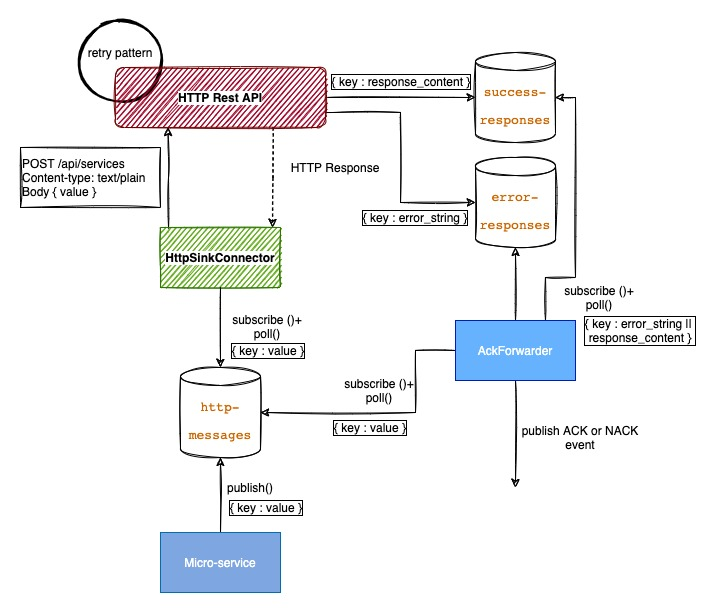

# kafka-http-request-reply
Kafka Http Connector Request/Reply use case

## Use case



Mock HTTP Service return :
- 30% HTTP 400 Error code, 200 or 201 otherwise.
- 50% of 200/201 responses contains "Message OK", otherwise "Message KO" (Used to known if message is correct functionally or not).

## Start

``` bash
cd tools/
docker-compose build
docker-compose up -d
# Wait some seconds, before deploying kafka connector
./deploy-connector./sh
```

## Usage

``` bash
# Produce some messages into http-messages topic
docker exec -it base /bin/sh
kafka-console-producer --bootstrap-server kafka:29092 --topic http-messages --property key.separator=: --property parse.key=true
KEY1:VALUE1
KEY2:VALUE2 ....
```

``` bash
# In parrallel, consume ack-status topics (you can also use AKHQ http://localhost:8082) and see ack messages
docker exec -it base /bin/sh
kafka-console-consumer --bootstrap-server kafka:29092 --topic ack-status --from-beginning
...
```

